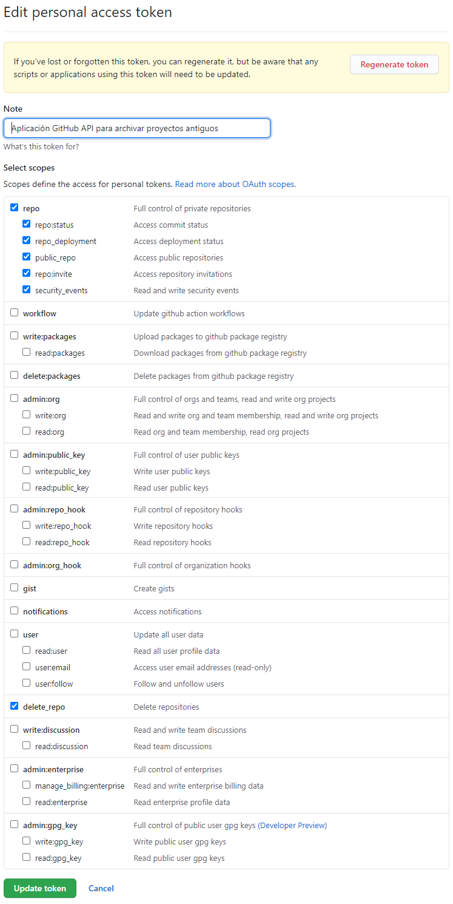

# Gestor de repos de GitHub.com/Adalab

## Cómo arrancar el proyecto

1. Crea un [token de usuario en GitHub](https://docs.github.com/es/github/authenticating-to-github/creating-a-personal-access-token) con los siguientes permisos:
   
1. Crear un el fichero `./src/secrets/github-secrets.json`.
1. Añadir al fichero el token de GitHub:
   ```json
   {
     "token": "TOKEN_DE_USUARIO_DE_GITHUB"
   }
   ```
1. Instalar las dependencias con `npm install`.
1. Arrancar el proyecto con `npm start`.

## Cómo usar el proyecto

Al arrancar el proyecto aparecerá un listado con todos los repos de GitHub.com/Adalab.

Cada repo tiene dos botones:

- Un botón para crear un issue en el repo. Al pulsar este botón:
   - Se crea [este issue](./src/services/issue.js) con el título **AdaBot: por favor transfiere o borra este repositorio**.
   - Se dan permisos de administración a todos los colaboradores del repo para que cualquiera de ellos lo pueda borrar o transferir.
- Un botón para borrar el repo:
   - Este botón solo aparece si alguien ha creado en el repo un issue:
      - Cuyo título es **AdaBot: por favor transfiere o borra este repositorio**.
      - Han pasado más de 15 días de la creación del issue.
   - Esta es una medida de seguridad para poder dar a las alumnas 15 para que transfieran el repo, antes de borrárselo.

### Función deshacer (Ctrl+Z)

Todas las llamadas al API de GitHub se hacen con 10 segundos de retraso. De esta forma si te equivocas al enviar un issue o al borrar un repo tienes 10 segundos para cerrar la página. De esta forma la petición al API no se enviará.

### Colores de los repos

Con los repos de color rojo hay que tener cuidado, son repos que:

- Uno de los colaboradores es empleado de Adalab.
- O es privado.