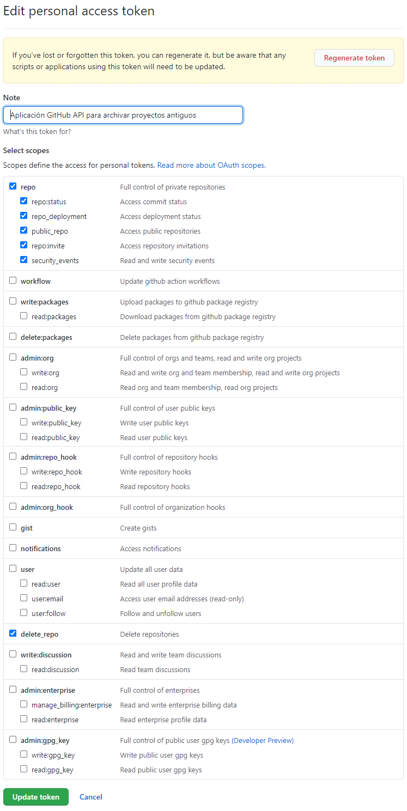

# Gestor de repos de GitHub.com/Adalab

## Cómo arrancar el proyecto

1. Crea un [token de usuario en GitHub](https://docs.github.com/es/github/authenticating-to-github/creating-a-personal-access-token) con los siguientes permisos:
   
1. Instala las dependencias con `npm install`.
1. Arranca el proyecto con `npm start`.
1. Sigue las instrucción del proyecto.

## Cómo desplegar el proyecto en GitHub Pages

1. Ejecuta `npm run build`
